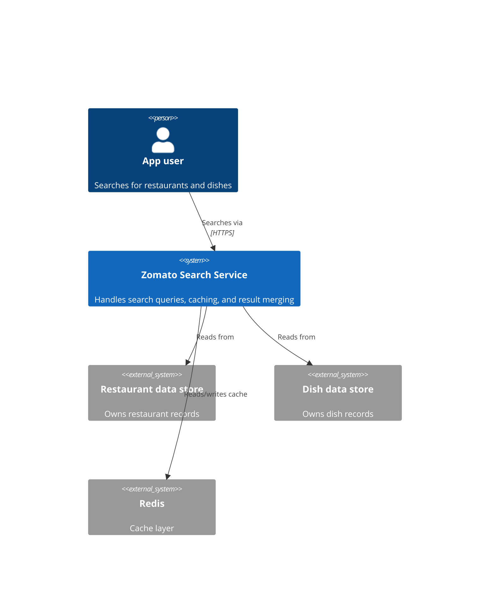
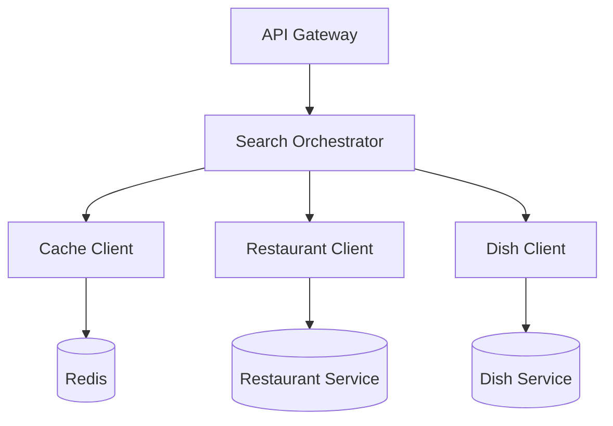
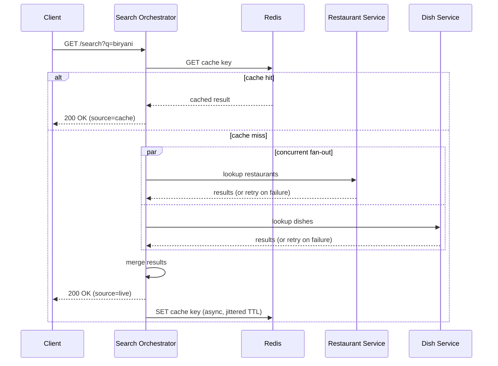

<div align="center">

# 📦 ZomatoSearch

### Concurrent Search Backend for Restaurant & Dish Discovery

**Cut search latency by ~50% by fanning out restaurant and dish lookups in parallel, with Redis caching and graceful failure handling on top.**


[Impact Summary](#-impact-summary) · [Problem](#-problem) · [Solution](#-solution) · [Architecture](#-architecture) · [Build Process](#-build-process) · [Getting Started](#-getting-started) · [Interview Notes](#-interview-notes)


</div>

---

## ⚡ Impact Summary

*For recruiters and hiring managers skimming this — the 15-second version:*

| | |
|---|---|
| **What it is** | A Go backend that searches restaurants and dishes concurrently instead of sequentially |
| **Core skill demonstrated** | Concurrency (goroutines/WaitGroups), caching strategy, fault-tolerant system design |
| **Measured result** | Latency dropped from `a + b` (sequential) to `max(a, b)` (concurrent) — verified with real timing, not estimated |
| **Production concerns handled** | Context timeouts, capped retries, partial-failure degradation, structured logging, health checks |
| **Stack** | Go 1.22 · Redis (cache-aside) · net/http |

> Built incrementally in 8 tracked batches (see below) so every design decision has a measurable before/after — this wasn't written in one sitting to look impressive on a resume.

---

## 🧩 Problem

A naive search implementation looks up restaurants, then dishes, then combines them — **sequentially**. That means:
- Total response time is the **sum** of both lookups.
- A single slow or failing dependency takes the **whole request down** with it.

Neither is acceptable at real scale.

## 💡 Solution

- **Fan out, don't queue up.** Restaurant and dish lookups run concurrently as goroutines, so total latency is roughly `max(a, b)` instead of `a + b`.
- **Cache what's already been asked.** A Redis cache-aside layer returns repeat queries instantly, with a jittered TTL so keys don't all expire in the same instant under load.
- **Expect things to fail, and don't collapse when they do.** Capped retries recover from transient blips; if one lookup still fails, the response returns whatever the other one found instead of erroring out entirely.

---

## 🏗️ Architecture

```
                     Client
                       │  GET /search?q=...
                       ▼
            ┌─────────────────────┐
            │   HTTP Handler        │
            │   (logging + timeout) │
            └──────────┬───────────┘
                       ▼
            ┌─────────────────────┐
            │    Search Service     │
            └──────────┬───────────┘
                       │
          ┌────────────┴─────────────┐
          ▼                          ▼
   Redis Cache hit?           Cache miss → fan out:
   → return instantly          ├─ Restaurant lookup (retry)
                               └─ Dish lookup (retry)
                                       │
                               merge → respond
                                       │
                        async write-back to Redis (jittered TTL)
```

### System context diagram



### Component diagram



### Sequence diagram



### End-to-end request flow

1. **Client** sends `GET /search?q=biryani`.
2. **API Gateway** (a separate service in a real split) authenticates the request and routes it to the Search Orchestrator.
3. **Search Orchestrator** checks Redis first (cache-aside). On a hit, it returns immediately — no downstream services touched.
4. On a **cache miss**, the orchestrator fans out concurrently to two independent domain services: **Restaurant Service** and **Dish Service**.
5. Each domain service owns its own data (its own DB in a real split), and each call is wrapped in a capped retry for transient blips.
6. The orchestrator merges whatever comes back — even if only one service responded successfully — and returns the combined result.
7. The result is written back to Redis **asynchronously**, so the client isn't kept waiting on the cache write.

---

## 🔖 Build Process

Built incrementally, one working checkpoint at a time — every design choice below has an actual before/after behind it, not a single commit dump.

| Batch | Focus | What it added |
|---|---|---|
| 1 | Setup & Models | Project init, `Restaurant`/`Dish`/`SearchResult` structs, minimal `main.go` |
| 2 | HTTP (Sequential) | `/search` endpoint calling stubbed lookups one after another — **baseline latency measured here** |
| 3 | Concurrency | Both lookups moved into goroutines under a `WaitGroup` — **latency drops from sum → max; this is the number behind the resume line** |
| 4 | Timeouts / Context | Shared context deadline so one slow dependency can't hang the whole request |
| 5 | Redis Cache-Aside | Check-cache-first wired in; repeat queries return near-instantly |
| 6 | Retry / Resilience | Capped retry with backoff on transient lookup failures |
| 7 | Partial-Failure Handling | One lookup failing no longer fails the whole request |
| 8 | Hardening | Structured logging, `/healthz`, server-level read/write timeouts, jittered cache TTL |

---

## ▶️ Getting Started

```bash
docker run -p 6379:6379 redis:7-alpine
go mod tidy
go run main.go
```

```bash
curl "http://localhost:8080/search?q=biryani"
curl "http://localhost:8080/healthz"
```

First hit for a query goes to the (simulated) live path; anything within 5 minutes after that comes back from cache.

## 🔍 What's Stubbed vs. Real

`searchRestaurants` and `searchDishes` return simulated data — there's no real database or search index behind this. The point of the project is the concurrency/caching/failure-handling layer around them, not the search index itself. Those two functions are where real DB/Elasticsearch calls would slot in without changing anything else downstream.

---

## 🎯 Interview Notes

Quick answers to the questions this project is designed to invite:

- **Why concurrency here?** The two lookups are independent, so there's no reason to serialize them — parallel execution drops latency to `max(a, b)`.
- **Why cache-aside over write-through?** Search results tolerate a little staleness, so check-then-cache is simpler and cheaper than keeping the cache in lockstep with every write.
- **Why return partial results?** A broken dish index shouldn't mean the user gets nothing — some results beat an error page.
- **What does "production-grade" mean here?** Timeouts everywhere, capped (not infinite) retries, structured logs, and a health check a load balancer can actually use.

---

<div align="center">

*Personal project inspired by how food-delivery search platforms operate — not a claim of employment at Zomato or Swiggy. Listed on my resume as a personal project, not work experience.*

</div>
